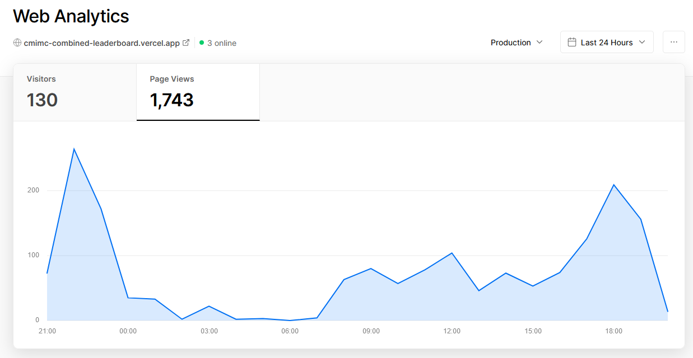
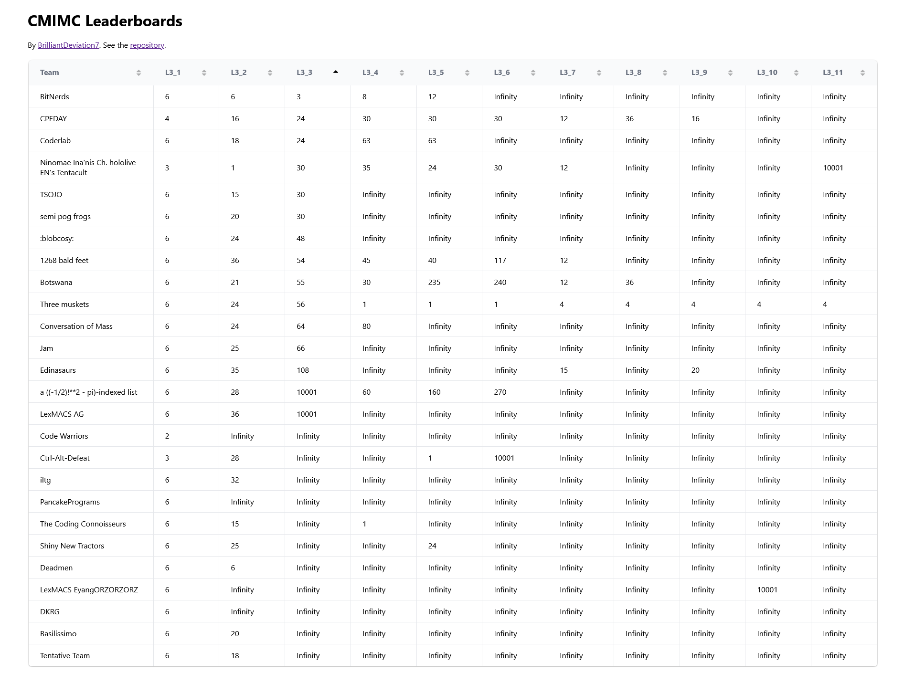
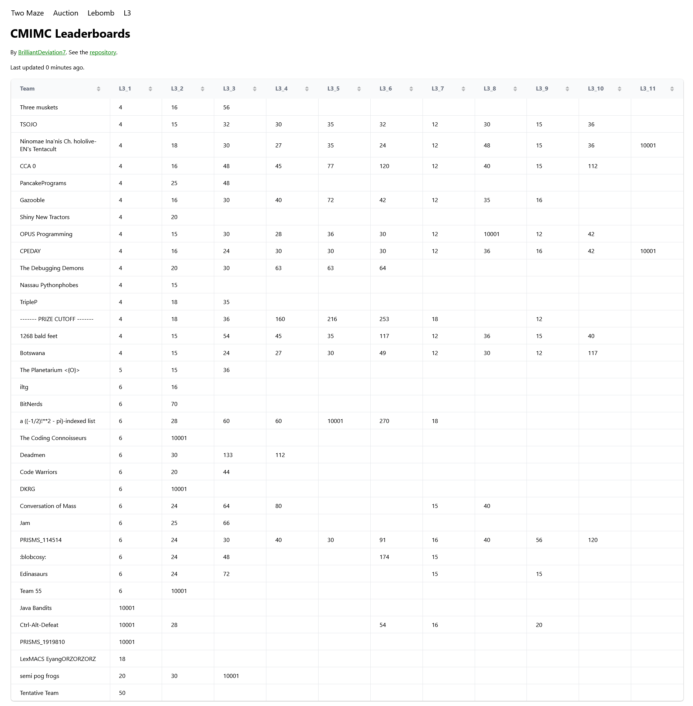
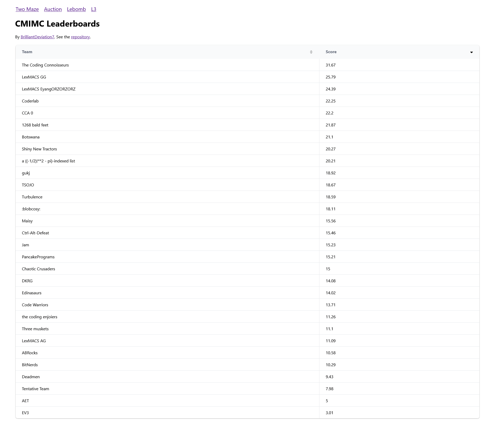
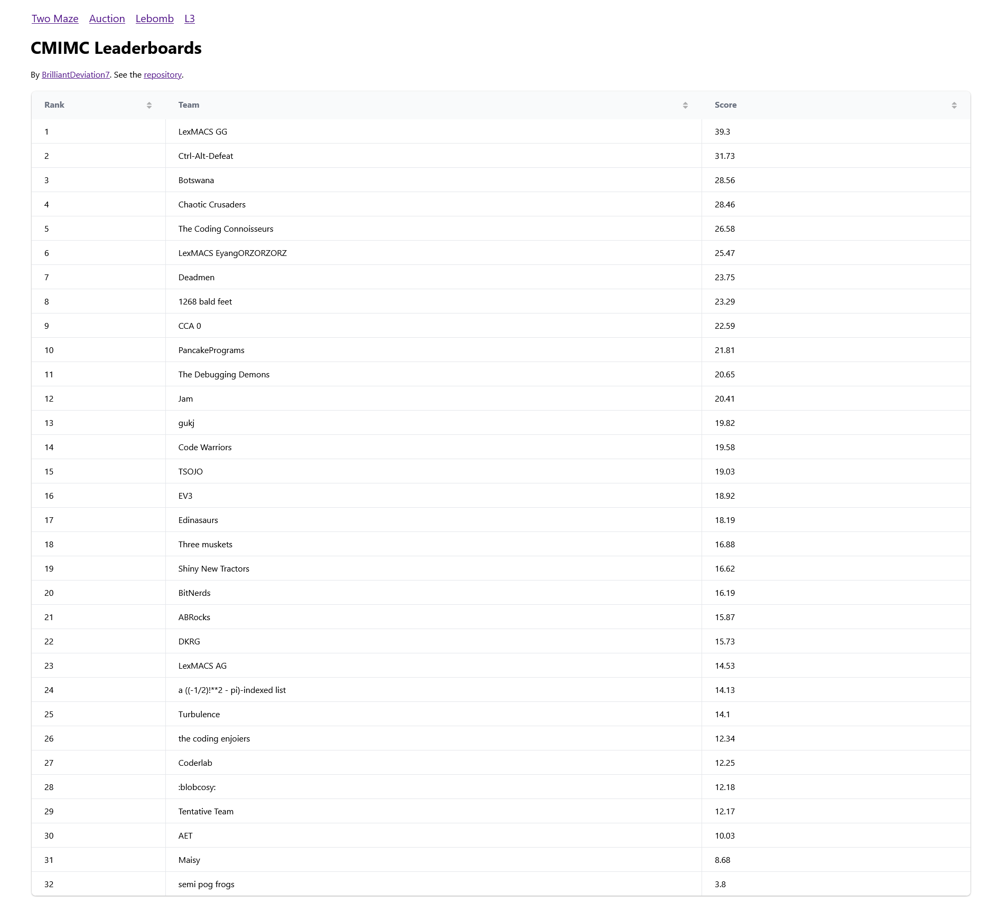

# cmimc-combined-leaderboard

I made this during and for [CMIMC 2023](https://cmimc.math.cmu.edu/programming) because the official leaderboard lacked functionality and was inconvenient. This SvelteKit project scrapes the leaderboard data from the official website's 14 different pages to display it on 3 pages. For example, it combined the 11 leaderboards for the L3 task into 1 page so it was easy to view the progress of all teams for all tasks in the same place.

The leaderboards for the optimization problem and the two AI rounds were also added on separate pages, making it very fast to switch between them (instead of using a dropdown and submit button on the official website).

I competed with LexMACS GG. Thank you to everyone who used this project! It was fun building it!

## Images

### Version 1 of L3 Leaderboard

### Final Version of L3 Leaderboard

I added a "last updated" time indicator and removed `Infinity` from the cells.

### Lebomb Leaderboard

The Auction and Two Maze leaderboards look like this as well.

